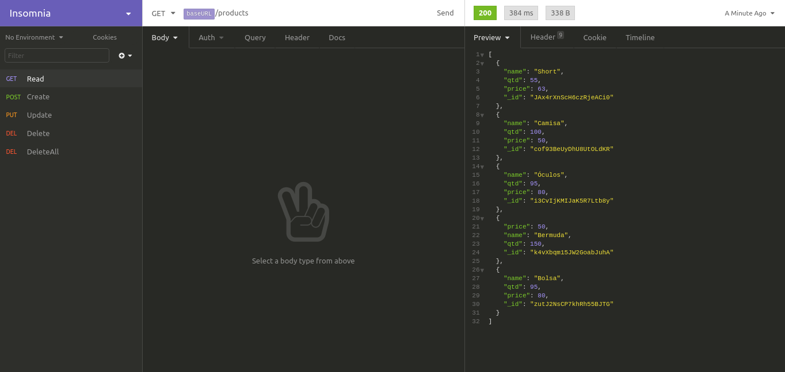

## API - NodeJS + Firebase Firestore e Firebase Functions

A api possui cinco operações: Create, Read, Update, Delete e DeleteAll, utilizadas em bases de dados.

### Dependências

As dependências são:

- express
- firebase-admin
- firebase-functions
- cors

A dependência de desenvolvedor é:

- firebase-functions-test

> Todas podem ser obtidas através do npm

##### Aconselhado o uso do insomnia para a realização das operações

[API](https://us-central1-testenodejs-3b9ac.cloudfunctions.net/api/products)
